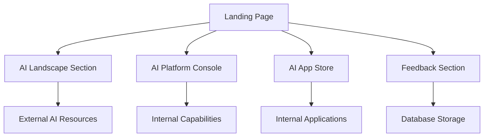

## 1. Product Overview
ABC AI Community is a professional landing page that serves as the central hub for showcasing cutting-edge AI technologies and internal AI resources. It bridges external AI landscape trends with internal company capabilities, designed for a tech-driven organization that values professionalism and future technology aesthetics.

The platform targets tech professionals, AI enthusiasts, and internal teams who need quick access to both external AI trends and internal AI tools and resources.

## 2. Core Features

### 2.1 User Roles
| Role | Registration Method | Core Permissions |
|------|---------------------|------------------|
| Visitor | No registration required | Browse all content, submit feedback |
| Admin | Internal authentication | Manage content, view analytics |

### 2.2 Feature Module
Our ABC AI Community landing page consists of the following main sections:
1. **AI Landscape Showcase**: External AI trends including leaderboards, marketplaces, trending technologies, developer tools, and CLI tools
2. **AI Platform Console**: Internal offerings featuring wiki links, Teams channels, and internal capabilities showcase
3. **AI App Store**: Internal web applications directory with direct access links
4. **Feedback System**: User requirement submission and storage functionality

### 2.3 Page Details
| Page Name | Module Name | Feature description |
|-----------|-------------|---------------------|
| Landing Page | Hero Section | Display company branding with cyberpunk dark theme and subtle shimmering animations |
| Landing Page | AI Landscape | Show AI model leaderboards (Chatbot Arena, MMMU, GPQA), AI marketplaces grid (OpenRouter, Grok, Fireworks AI), trending AI technologies chart (Agentic AI, MCP, Toolings), developer tools showcase (Cursor, etc.), and top CLI tools (Cloud Code, OpenCode, AIDER) |
| Landing Page | AI Platform Console | Feature internal wiki page links, Microsoft Teams channel links, showcase internal capabilities (Model Garden, RAG Studio, Document Intelligence) |
| Landing Page | AI App Store | List internal web applications with names, direct links, and brief descriptions (MCPAP.AI, Prompt Book, AI Platform) |
| Landing Page | Feedback Section | Allow users to submit requirements/comments that are saved to database |
| Landing Page | Fixed Header | Persistent navigation bar at top of page with smooth scrolling to sections |

## 3. Core Process
Users arrive at the landing page and can immediately browse through different sections showcasing both external AI landscape and internal offerings. They can explore AI leaderboards, discover new tools, access internal resources through provided links, and submit feedback through the requirement submission form. The page provides smooth navigation between sections with a fixed header for easy access.

## 4. User Interface Design

### 4.1 Design Style
- **Primary Colors**: Deep cyberpunk dark theme with neon accents (electric blue #00D4FF, purple #9D4EDD)
- **Secondary Colors**: Dark backgrounds (#0A0A0A, #1A1A1A) with glowing borders
- **Button Style**: Rounded corners with gradient effects and hover animations
- **Font**: Modern sans-serif (Roboto/Inter) with hierarchical sizing (H1: 48px, H2: 36px, Body: 16px)
- **Layout Style**: Card-based grid layout with dark mode optimization
- **Icon Style**: Professional logos and custom neon-style icons with subtle glow effects

### 4.2 Page Design Overview
| Page Name | Module Name | UI Elements |
|-----------|-------------|-------------|
| Landing Page | Hero Section | Full-width dark background with animated gradient overlay, company logo with neon glow, subtle particle effects |
| Landing Page | AI Landscape | Card-based grid layout with dark cards, neon border highlights on hover, professional tool logos, animated progress bars for rankings |
| Landing Page | AI Platform Console | Dark theme cards with internal branding, Teams integration icons, capability badges with hover effects |
| Landing Page | AI App Store | Application cards with screenshots/descriptions, direct access buttons with neon accents, smooth hover transitions |
| Landing Page | Feedback Section | Dark form inputs with glowing focus states, submit button with cyberpunk styling, success animation |
| Landing Page | Fixed Header | Semi-transparent dark background with blur effect, neon accent underline, smooth scroll navigation |

### 4.3 Responsiveness
Desktop-first design approach with mobile adaptation. Touch interaction optimization for mobile devices with larger tap targets and swipe-friendly navigation.

### 4.4 Animation Guidelines
Subtle shimmering animations on key elements including:
- Hero section background with slow gradient shifts
- Card hover effects with neon glow intensification
- Button interactions with ripple effects
- Loading states with pulsing animations
- Smooth scroll transitions between sections