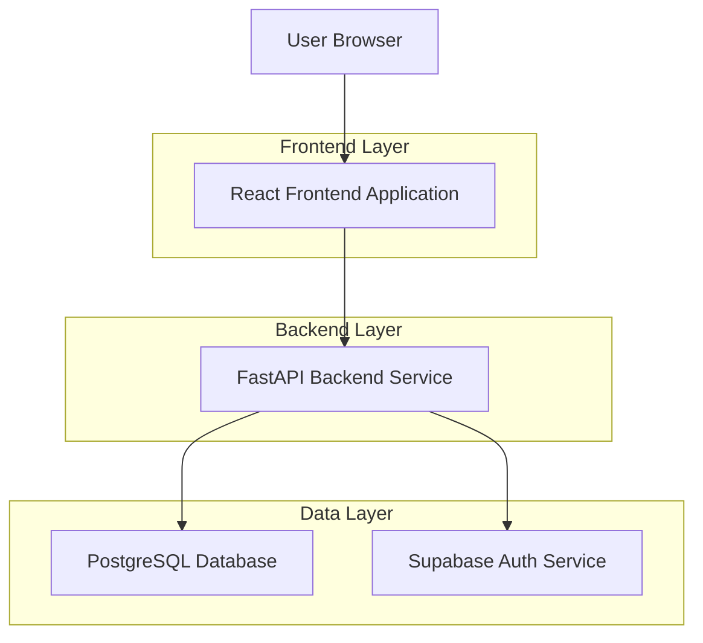
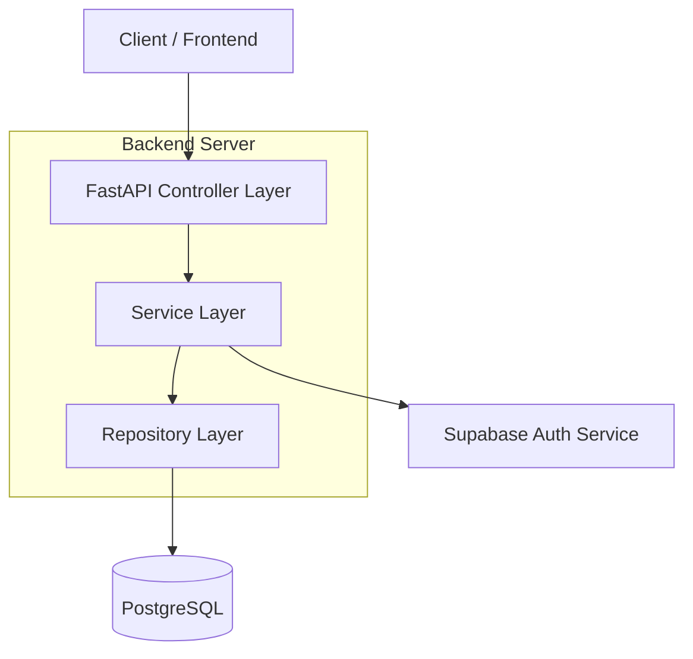
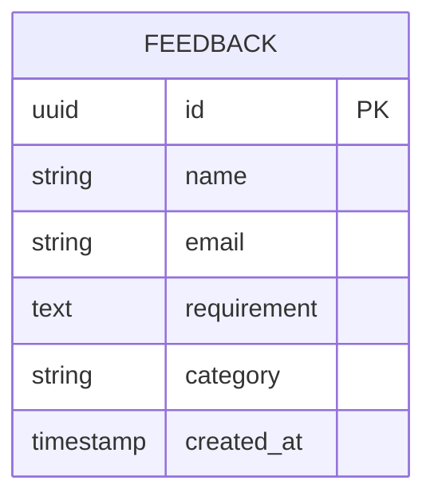

## 1. Architecture Design



## 2. Technology Description

- **Frontend**: React@18 + Material-UI@5 + Vite
- **Initialization Tool**: vite-init
- **Backend**: FastAPI@0.104 + Python@3.12
- **Database**: PostgreSQL (optional connection on startup)
- **Authentication**: Supabase Auth (integrated with backend)

## 3. Route Definitions

| Route | Purpose |
|-------|---------|
| / | Landing page with all sections (AI Landscape, AI Platform Console, AI App Store, Feedback) |
| /api/feedback | POST endpoint for submitting user requirements/comments |
| /api/health | Health check endpoint for service monitoring |

## 4. API Definitions

### 4.1 Core API

**User Feedback Submission**
```
POST /api/feedback
```

Request:
| Param Name | Param Type | isRequired | Description |
|------------|------------|------------|-------------|
| name | string | false | User name (optional) |
| email | string | false | User email (optional) |
| requirement | string | true | User requirement/comment |
| category | string | false | Category of feedback (AI Landscape, Platform Console, App Store, Other) |

Response:
| Param Name | Param Type | Description |
|------------|------------|-------------|
| success | boolean | Submission status |
| message | string | Response message |
| id | string | Feedback ID (if successful) |

Example Request:
```json
{
  "name": "John Doe",
  "email": "john@example.com",
  "requirement": "Need more AI model comparison tools",
  "category": "AI Landscape"
}
```

**Health Check**
```
GET /api/health
```

Response:
| Param Name | Param Type | Description |
|------------|------------|-------------|
| status | string | Service status |
| database | string | Database connection status |
| timestamp | string | Current timestamp |

## 5. Server Architecture Diagram



## 6. Data Model

### 6.1 Data Model Definition



### 6.2 Data Definition Language

**Feedback Table (feedback)**
```sql
-- create table
CREATE TABLE feedback (
    id UUID PRIMARY KEY DEFAULT gen_random_uuid(),
    name VARCHAR(255),
    email VARCHAR(255),
    requirement TEXT NOT NULL,
    category VARCHAR(50) DEFAULT 'Other',
    created_at TIMESTAMP WITH TIME ZONE DEFAULT NOW()
);

-- create index for performance
CREATE INDEX idx_feedback_created_at ON feedback(created_at DESC);
CREATE INDEX idx_feedback_category ON feedback(category);

-- grant permissions (if using Supabase)
GRANT SELECT ON feedback TO anon;
GRANT ALL PRIVILEGES ON feedback TO authenticated;
```

## 7. Configuration Requirements

### 7.1 Environment Variables
- `DATABASE_URL`: PostgreSQL connection string (optional for startup)
- `SUPABASE_URL`: Supabase project URL
- `SUPABASE_ANON_KEY`: Supabase anonymous key
- `CORS_ORIGINS`: Allowed CORS origins for frontend

### 7.2 Optional Database Startup
The FastAPI service should start successfully even without database connection, with graceful degradation:
- Feedback submissions are queued or logged locally when database is unavailable
- Health check endpoint indicates database status
- Service resumes normal operation when database becomes available